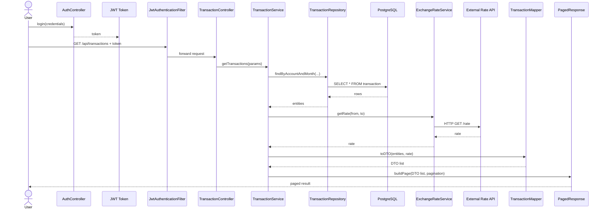
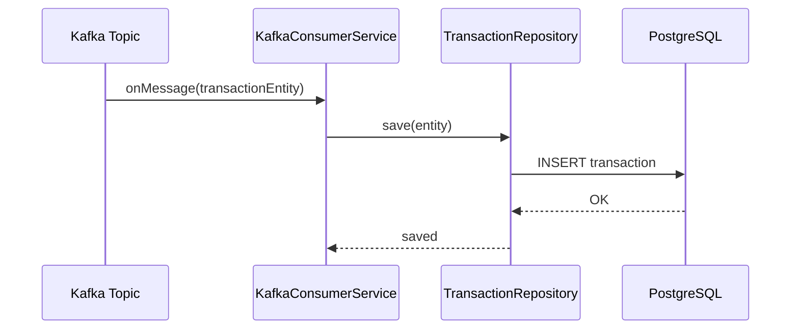

# e-Banking Transaction Service (PostgreSQL Edition)

本專案實現一個微服務 (Java 17 + Spring Boot 3)，主要功能：
- 從 Kafka 消費交易訊息並儲存到 PostgreSQL
- 按「帳戶 IBAN + 年月」分頁查詢交易清單
- 查詢結果中，對每筆交易做匯率換算並回傳當頁總借總貸
- 採用 JWT 驗證，僅允許帶 Bearer Token 之使用者查詢自己的帳號
- 整合 Spring Boot Actuator + Micrometer，暴露 Prometheus 指標
- 日誌使用 Logback，顯示 SQL、Kafka 訊息等
- 單元 / 整合測試 (JUnit 5 + Mockito + Testcontainers)
- Docker 化，提供 Dockerfile
- Kubernetes 部署範例 (ConfigMap、Deployment、Service)
- CircleCI 配置範例，自動化測試與映像推送

---

## 目錄結構
```text
e-banking-transaction-service/
├── .circleci/ # CircleCI 設定
├── k8s/ # Kubernetes 部署檔
├── Dockerfile # Docker 映像建置
├── README.md # 本檔案
├── pom.xml # Maven 設定
└── src/
├── main/
│ ├── java/ebanking/
│ │ ├── TransactionServiceApplication.java
│ │ ├── config/ # KafkaConfig, SecurityConfig, OpenAPIConfig
│ │ ├── controller/ # TransactionController.java
│ │ ├── dto/ # TransactionDTO, PagedResponse
│ │ ├── exception/ # ResourceNotFoundException, ApiExceptionHandler
│ │ ├── model/ # TransactionEntity
│ │ ├── repository/ # TransactionRepository
│ │ ├── security/ # JwtUtil, JwtAuthenticationFilter, UserDetailsServiceImpl
│ │ ├── service/ # ExchangeRateService, KafkaConsumerService, TransactionService
│ │ └── util/ # ModelMapperConfig
│ └── resources/
│ ├── application.yml
│ └── logback-spring.xml
└── test/
└── java/ebanking/
├── controller/ # TransactionControllerIntegrationTest
├── repository/ # TransactionRepositoryTest
└── service/ # TransactionServiceTest
```

---

## 本地開發

### 環境需求

- JDK 17
- Maven 3.8+
- Docker (用於 Testcontainers 或本地測試)
- PostgreSQL (若不使用 Testcontainers)
- Kafka (若不使用 Testcontainers)

### 設定環境變數 (可選)

- `POSTGRES_HOST` (default: `localhost`)
- `POSTGRES_PORT` (default: `5432`)
- `POSTGRES_USER` (default: `postgres`)
- `POSTGRES_PASSWORD` (default: `postgres`)
- `KAFKA_BOOTSTRAP_SERVERS` (default: `localhost:9092`)
- `JWT_SECRET` (務必自行設置隨機字串)

### 執行步驟

1. `git clone <repository_url>`
2. 開啟 IDE，匯入 Maven 專案
3. 在 `application.yml` 裡確認資料庫與 Kafka 設定
4. 執行 `ebanking.TransactionServiceApplication.main(...)`
5. 開啟瀏覽器查看 Swagger UI：  

http://localhost:8080/swagger-ui.html

6. 取得 JWT：  
- 本範例僅提供硬編碼的測試使用者 `user123/userpass`，可自行在 `UserDetailsServiceImpl` 修改
- 可使用 `JwtUtil` 類產生 Token：  
  ```java
  String token = jwtUtil.generateToken("CH93000000000000000000");
  ```
- 帶上 Header：  
  ```
  Authorization: Bearer <token>
  ```

### 執行測試

```bash
mvn clean test

單元測試：TransactionServiceTest

Repository 測試：TransactionRepositoryTest (Testcontainers PostgreSQL)

整合測試：TransactionControllerIntegrationTest (Testcontainers PostgreSQL + Kafka)


# Kafka 消费时序图


