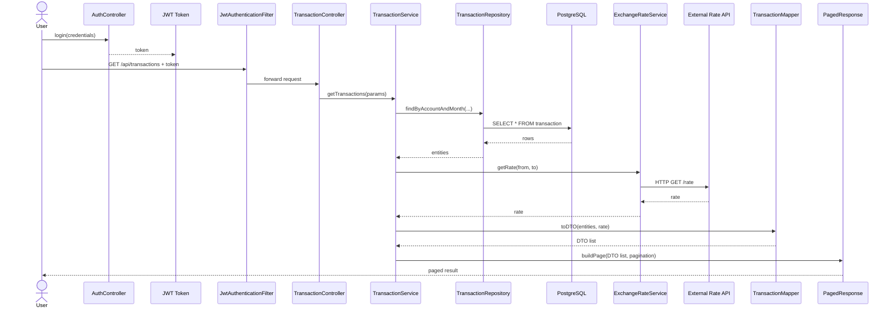
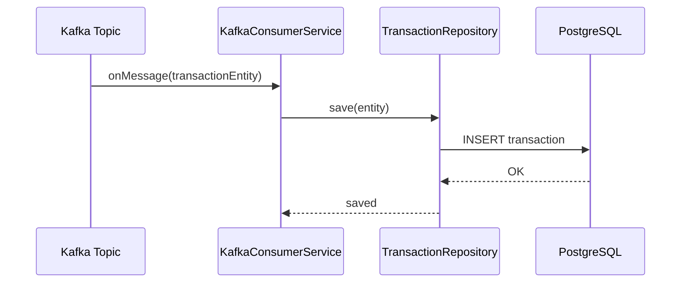

# e-Banking Transaction Service

本專案實現一個微服務 (Java 17 + Spring Boot 3)，主要功能：
- 從 Kafka 消費交易訊息並儲存到 PostgreSQL
- 按「帳戶 IBAN + 年月」分頁查詢交易清單
- 查詢結果中，對每筆交易做匯率換算並回傳當頁總借總貸
- 採用 JWT 驗證，僅允許帶 Bearer Token 之使用者查詢自己的帳號
- 整合 Spring Boot Actuator + Micrometer，暴露 Prometheus 指標
- 日誌使用 Logback，顯示 SQL、Kafka 訊息等
- 單元 / 整合測試 (JUnit 5 + Mockito + Testcontainers)
- Docker 化，提供 Dockerfile
- Kubernetes 部署範例 (ConfigMap、Deployment、Service)
- CircleCI 配置範例，自動化測試與映像推送
---

## 目錄結構
```text
ebanking/
├── .circleci/            # CircleCI 設定 (config.yml)
├── certs/                # JWT 金鑰 (private.pem, public.pem)
├── k8s/                  # Kubernetes 部署檔 (configmap.yaml 等)
├── Dockerfile
├── Dockerfile2
├── docker-compose.yml
├── k3d-kubeconfig.yaml
├── run-service.ps1
├── values-kafka.yaml
├── README.md
├── pom.xml               # Maven 設定
└── src/
    ├── main/
    │   ├── java/ebanking/
    │   │   ├── TransactionServiceApplication.java
    │   │   ├── config/        # CustomPostgreSQLDialect, KafkaConsumerConfig, OpenAPIConfig, SecurityConfig
    │   │   ├── controller/    # TransactionController
    │   │   ├── dto/           # PagedResponse, TransactionDTO
    │   │   ├── exception/     # ApiExceptionHandler, ResourceNotFoundException
    │   │   ├── kafka/         # KafkaConfig, TransactionConsumer
    │   │   ├── mapper/        # TransactionMapper
    │   │   ├── model/         # TransactionEntity, UserEntity
    │   │   ├── repository/    # TransactionRepository, UserRepository
    │   │   ├── security/      # AuthController, JwtUtil, JwtAuthenticationFilter 等
    │   │   ├── service/       # ExchangeRateService, TransactionService, UserService 等
    │   │   └── util/          # ModelMapperConfig
    │   └── resources/
    │       ├── application.yml
    │       ├── ebanking/mapper/TransactionMapper.xml
    │       └── logback-spring.xml
    └── test/
        ├── java/ebanking/
        │   ├── controller/   # TransactionControllerIntegrationTest
        │   ├── repository/   # TransactionRepositoryTest
        │   └── service/      # TransactionServiceTest
        └── resources/
            ├── application.yml
            └── schema.sql
```

---

## 本地開發

### 環境需求

- JDK 17
- Maven 3.8+
- Docker 
- PostgreSQL 
- Kafka 3.9.1
- Scala 2.13


### 設定環境變數 (可選)

- `POSTGRES_HOST` 
- `POSTGRES_PORT` 
- `POSTGRES_USER` 
- `POSTGRES_PASSWORD`
# KAFKA伺服器
- `KAFKA_BOOTSTRAP_SERVERS`
# JWT 金鑰（讀檔、RSA）
- `SPRING_SECURITY_JWT_PRIVATE_KEY`
- `SPRING_SECURITY_JWT_PUBLIC_KEY`
# JWT 過期時間（毫秒）
- `SPRING_SECURITY_JWT_EXPIRATION_IN_MS`

以下為部分需求內容
The list of transactions should be consumed from a Kafka topic.
The transactions cover the last ten years and are stored in Kafka with the key being the transaction ID and the value the JSON representation of the transaction.

雖然以上需求寫查詢資料來源在kafka，但我認為是指核心系統的資料來源在kafka，不代表我的入口網站查詢也一定要從kafka查詢，因為kafka終究是日誌系統，主要是高吞吐量消息發送，kafka也能做到分頁查詢，但效能輸給其他查詢方式，使用體驗上是糟糕的，並且考量到kafka可能權責在核心系統，我無法任意修改進行效能調教，我認為同步資料在別的地方進行查詢也是個方法

以此情境來說，有以下四種實現分頁查詢的方式
1.kafka直接查詢
2.RDBMS
3.noSQL
4.TSDB
我認為尚不需要使用NOSQL或TSDB，經過計算此案例平均為193QPS，峰值算三倍600QPS，postgresql的效能遠足以應付這種量級的查詢，而RDBMS針對分頁式查詢是強項，個人認為可以使用postgresql





# Kafka 消费时序图





### 執行測試

```bash
mvn clean test

單元測試：TransactionServiceTest

Repository 測試：TransactionRepositoryTest (Testcontainers PostgreSQL)

整合測試：TransactionControllerIntegrationTest (Testcontainers PostgreSQL + Kafka)

```


