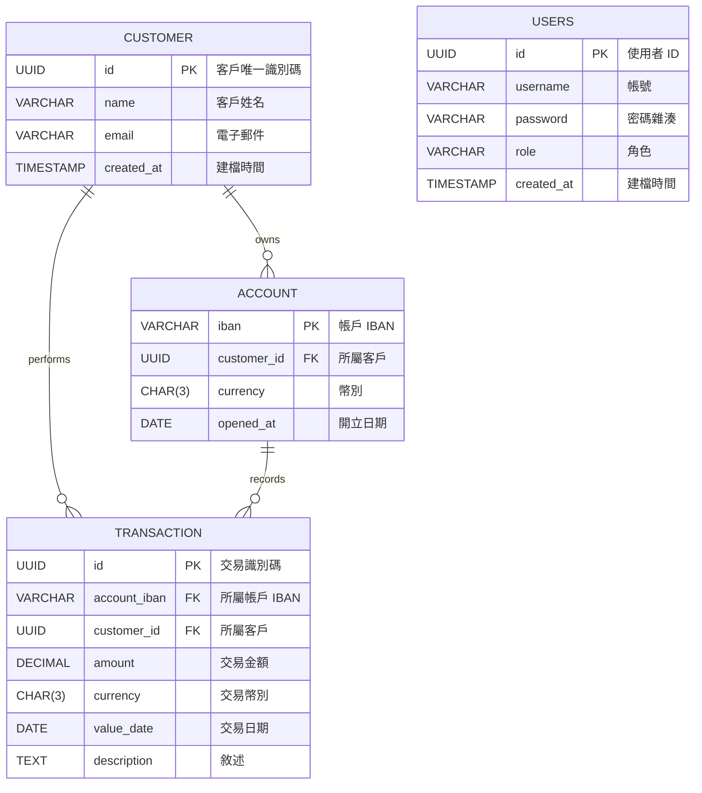

```mermaid
erDiagram
  CUSTOMER {
    UUID   id PK "客戶唯一識別碼"
    VARCHAR name "客戶姓名"
    VARCHAR email "電子郵件"
    TIMESTAMP created_at "建檔時間"
  }
  ACCOUNT {
    VARCHAR iban PK "帳戶 IBAN"
    UUID    customer_id FK "所屬客戶"
    CHAR(3) currency "幣別"
    DATE    opened_at "開立日期"
  }
  TRANSACTION {
    UUID    id PK "交易識別碼"
    VARCHAR account_iban FK "所屬帳戶 IBAN"
    UUID    customer_id FK "所屬客戶"
    DECIMAL amount "交易金額"
    CHAR(3) currency "交易幣別"
    DATE    value_date "交易日期"
    TEXT    description "敘述"
  }
  USERS {
    UUID      id PK "使用者 ID"
    VARCHAR   username "帳號"
    VARCHAR   password "密碼雜湊"
    VARCHAR   role "角色"
    TIMESTAMP created_at "建檔時間"
  }

  CUSTOMER ||--o{ ACCOUNT       : "owns"
  CUSTOMER ||--o{ TRANSACTION   : "performs"
  ACCOUNT  ||--o{ TRANSACTION   : "records"

```