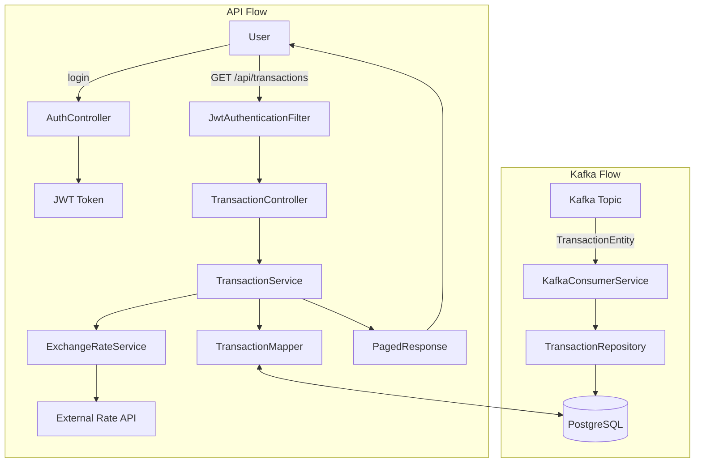

```mermaid
graph TD
    subgraph Kafka Flow
        Kafka[Kafka Topic] -->|TransactionEntity| KafkaConsumerService
        KafkaConsumerService --> TransactionRepository
        TransactionRepository --> PostgreSQL[(PostgreSQL)]
    end

    subgraph API Flow
        User -->|login| AuthController --> JWT[JWT Token]
        User -->|GET /api/transactions| JwtAuthenticationFilter
        JwtAuthenticationFilter --> TransactionController
        TransactionController --> TransactionService
        TransactionService --> TransactionMapper <--> PostgreSQL
        TransactionService --> ExchangeRateService --> RateAPI[External Rate API]
        TransactionService --> PagedResponse --> User
    end

```
