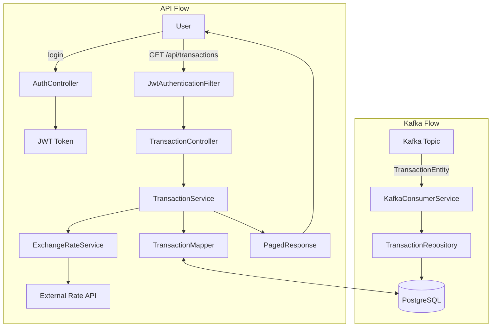

```
The transactions cover the last ten years and are stored in Kafka with the key being the transaction ID and the value the JSON representation of the transaction
```
以上為規劃的需求
kafka 消息發送格式 為key-value，範例如下
```
3fa85f64-5717-4562-b3fc-2c963f66afa6|{"id":"3fa85f64-5717-4562-b3fc-2c963f66afa6","accountIban":"CH93-0000-0000-0000-0000-0","amount":250.75,"currency":"EUR","valueDate":"2025-06-11","description":"Online payment CHF"}
```
每筆消息都會儲存至transaction table 供分頁查詢，資料庫格式參考
[規格書](document/spec.md)

kafka流程圖如下:

