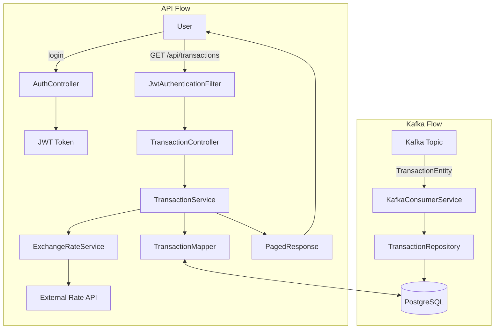

```
The transactions cover the last ten years and are stored in Kafka with the key being the transaction ID and the value the JSON representation of the transaction
```
以上為規劃的需求
kafka 消息發送格式 為key-value，範例如下
```
3fa85f64-5717-4562-b3fc-2c963f66afa6|{"id":"3fa85f64-5717-4562-b3fc-2c963f66afa6","accountIban":"CH93-0000-0000-0000-0000-0","amount":250.75,"currency":"EUR","valueDate":"2025-06-11","description":"Online payment CHF"}
```
每筆消息都會儲存至transaction table 供分頁查詢，資料庫格式參考
[規格書](document/spec.md)  

一天要寫入約 2670 萬 筆，平均 300 筆/s 量級。  
我將postgresql進行各種優化調教  
以月份進行分區表Partition Table  
增加連線池  
並核心為設計了端到端反應式批次寫入

### 端到端反應式批次寫入

使用Spring Boot Reactive + Reactor Kafka + R2DBC 
設計邏輯寫入規則為兩項  
1.500 筆滿就寫   
2.500ms 達到就寫  
滿足其中一種便會啟動反應式寫入，預計在postgresql能承受一秒一千筆的寫入，超過此需求300 筆/s 量級。  

kafka流程圖如下:

