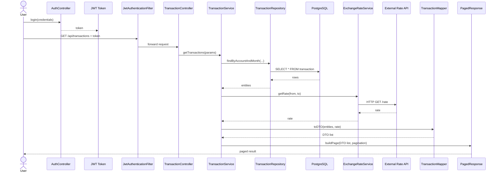

```mermaid
sequenceDiagram
    %% API 查詢流程
    actor User
    participant Auth      as AuthController
    participant JWT       as JWT Token
    participant Filter    as JwtAuthenticationFilter
    participant Controller as TransactionController
    participant Service   as TransactionService
    participant Repo      as TransactionRepository
    participant DB        as PostgreSQL
    participant RateSvc   as ExchangeRateService
    participant RateAPI   as External Rate API
    participant Mapper    as TransactionMapper
    participant Pager     as PagedResponse

    %% 登入並領取 Token
    User ->> Auth : login(credentials)
    Auth -->> JWT  : token

    %% 用 Token 呼叫查交易
    User ->> Filter     : GET /api/transactions + token
    Filter ->> Controller: forward request

    Controller ->> Service : getTransactions(params)
    
    %% 撈交易資料
    Service ->> Repo    : findByAccountAndMonth(...)
    Repo    ->> DB      : SELECT * FROM transaction
    DB      -->> Repo   : rows
    Repo    -->> Service: entities

    %% 拿匯率做換算
    Service ->> RateSvc : getRate(from, to)
    RateSvc ->> RateAPI : HTTP GET /rate
    RateAPI-->> RateSvc : rate
    RateSvc-->> Service : rate

    %% DTO 轉換與分頁
    Service ->> Mapper : toDTO(entities, rate)
    Mapper  -->> Service: DTO list

    Service ->> Pager   : buildPage(DTO list, pagination)
    Pager   -->> User    : paged result

```