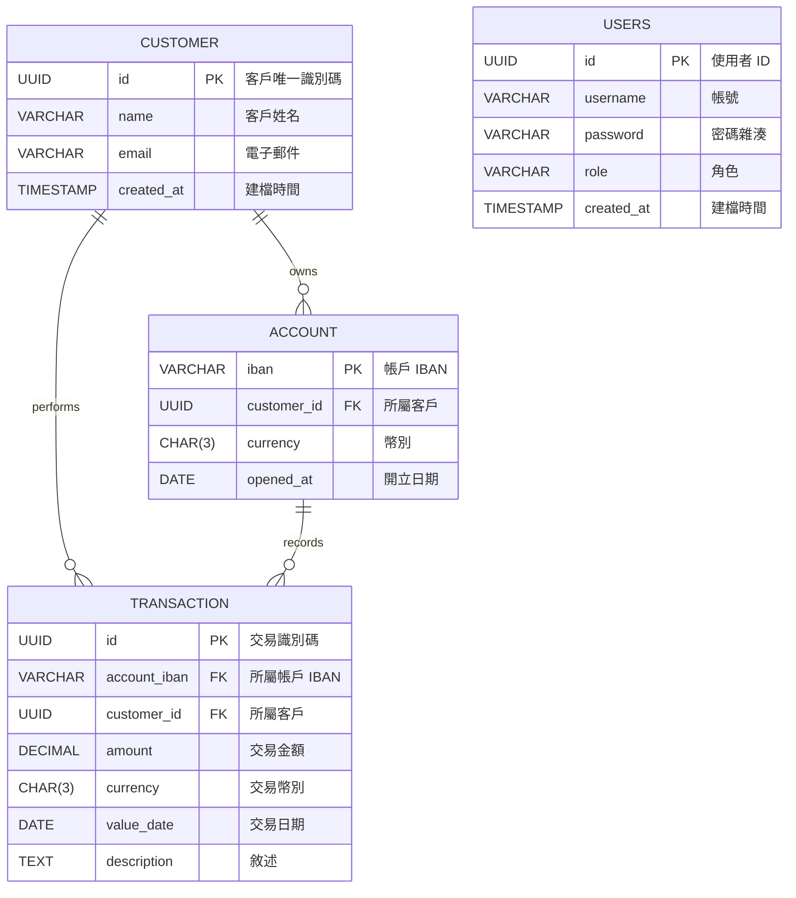

# 系統分析規格書

## 1. 系統概要

本系統為電子銀行交易服務（e-Banking Transaction Service），主要功能包括：
1. **客戶管理**：維護客戶基本資料（Customer）。
2. **帳戶管理**：維護客戶帳戶資料（Account），支援多幣別。
3. **交易記錄**：接收並儲存來自 Kafka 的交易訊息（Transaction），可依帳戶與日期分頁查詢。
4. **使用者認證**：管理系統使用者登入與授權（Users）。

特別說明一下，按照需求:
```
 design and implement a reusable REST API for returning the paginated list of money account transactions created in an arbitrary calendar month for a given customer who is logged-on in the portal. For each transaction ‘page’ return the total credit and debit values at the current exchange rate (from the third-party provider). 
```
在實際上查詢的時候只會用到account以及transaction，但會設定四個表格的原因如下:  
Customer:每個銀行客戶會開一個帳號進行管理  
Account:一個客戶可以有多個貨幣帳號  
transaction:每筆交易的詳細記錄，與Account是一對多的關係  
users:用於驗證token是否為合法用戶，並且role紀錄在此，與Customer分開是因為用戶組可以有多組權限拆分  

---

## 2. 功能需求

| 編號 | 功能名稱       | 描述                                                         |
|----:|--------------|------------------------------------------------------------|
| F1  | 交易寫入/查詢   | 消費者從 Kafka 接收交易，寫入 `transaction`；依帳戶、月份分頁查詢交易。                     |
| 

---

## 3. 非功能需求

- **安全性**：所有查詢 API 必須帶 Bearer Token，並僅限查詢自身資料。
- **效能**：每日交易量可達百萬筆，須支援分頁、索引、Partition，並在查詢時做匯率換算後彙總。
- **可維護性**：SQL Schema、程式模組要分層設計，單元與整合測試涵蓋率 ≥ 80%。

---

## 4. 資料庫表格定義

### 4.1 customer

| 欄位名稱    | 類型        | 條件          | 說明            |
|-----------|-----------|-------------|----------------|
| id        | UUID      | PK, Not Null | 客戶唯一識別碼    |
| name      | VARCHAR   | Not Null    | 客戶姓名         |
| email     | VARCHAR   | Not Null, UQ | 聯絡電子郵件      |
| created_at| TIMESTAMP | Not Null    | 建檔時間         |

### 4.2 account

| 欄位名稱      | 類型      | 條件             | 說明               |
|-------------|---------|----------------|------------------|
| iban        | VARCHAR | PK, Not Null     | 國際帳號編碼         |
| customer_id | UUID    | FK → customer.id | 所屬客戶             |
| currency    | CHAR(3) | Not Null         | 幣別（如 EUR, USD） |
| opened_at   | DATE    | Not Null         | 帳戶開立日期         |

### 4.3 transaction

| 欄位名稱        | 類型        | 條件              | 說明                             |
|---------------|-----------|-----------------|--------------------------------|
| id            | UUID      | PK, Not Null      | 交易識別碼                         |
| account_iban  | VARCHAR   | FK → account.iban | 交易所屬帳戶 IBAN                  |
| amount        | DECIMAL   | Not Null         | 交易金額                           |
| currency      | CHAR(3)   | Not Null         | 交易貨幣                           |
| value_date    | DATE      | Not Null         | 交易發生日                         |
| description   | TEXT      |                 | 交易敘述                           |
| created_at| TIMESTAMP | Not Null      | 建檔時間           |

### 4.4 users

| 欄位名稱    | 類型        | 條件           | 說明               |
|-----------|-----------|--------------|------------------|
| id        | UUID      | PK, Not Null  | 使用者唯一識別碼     |
| username  | VARCHAR   | Not Null, UQ  | 帳號名稱           |
| password  | VARCHAR   | Not Null      | Hash 後之密碼      |
| role      | VARCHAR   | Not Null      | 權限角色 (e.g. ADMIN, USER) |
| created_at| TIMESTAMP | Not Null      | 建檔時間           |

---

## 5. 資料庫 ER/UML 圖


