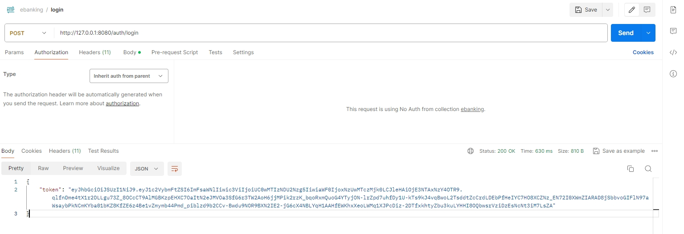

k8s建立pod成功


api伺服器也成功運作起來無報錯


因為需求寫The user is already authenticated and the API client invoking the transaction API will send a JWT token containing the user’s unique identity key

雖然呼叫我的伺服器已經完成JWT驗證，會帶JWT token給我的伺服器，但我必須先產出token，才能讓我的伺服器做驗證，所以我有先額外做login api服務，並不在需求內，但方便測試

呼叫login api 拿到token如圖




呼叫我的交易分頁查詢 API 但token錯誤的話如圖顯示，將會被拒絕呼叫，回傳403

錯誤訊息是
"Cannot extract username from JWT: 2025-06-17 13:20:30 (Taipei), current time: 2025-06-18 15:10:40 (Taipei)


填入驗證成功的token


填入查詢條件並成功得到查詢結果


查詢回來資料如下:
```
{
    "content": [
        {
            "id": "3fa85f64-5717-4562-b3fc-2c963f66afa6",
            "accountIban": "CH93-0000-0000-0000-0000-0        ",
            "customerId": "P-0123456789",
            "amount": 250.7500,
            "currency": "EUR",
            "valueDate": "2025-06-11",
            "description": "Sample transaction",
            "payload": "{\"id\": \"3fa85f64-5717-4562-b3fc-2c963f66afa6\", \"amount\": 250.75, \"currency\": \"EUR\", \"valueDate\": \"2025-06-11\", \"accountIban\": \"CH93-0000-0000-0000-0000-0\", \"description\": \"Sample transaction\"}",
            "amountInBaseCurrency": 8525.500000
        },
        {
            "id": "3fa85f64-5717-4562-b3fc-2c963f66afa8",
            "accountIban": "CH93-0000-0000-0000-0000-0        ",
            "customerId": "P-0123456789",
            "amount": 300.7500,
            "currency": "GBP",
            "valueDate": "2025-06-11",
            "description": "Sample transaction",
            "payload": "{\"id\": \"3fa85f64-5717-4562-b3fc-2c963f66afa8\", \"amount\": 300.75, \"currency\": \"USD\", \"valueDate\": \"2025-06-11\", \"accountIban\": \"CH93-0000-0000-0000-0000-0\", \"description\": \"Sample transaction\"}",
            "amountInBaseCurrency": 12048.045000
        },
        {
            "id": "3fa85f64-5717-4562-b3fc-2c963f66afa9",
            "accountIban": "CH93-0000-0000-0000-0000-0        ",
            "customerId": "P-0123456789",
            "amount": -100.2500,
            "currency": "EUR",
            "valueDate": "2025-06-11",
            "description": "Sample transaction",
            "payload": "{\"id\": \"3fa85f64-5717-4562-b3fc-2c963f66afa9\", \"amount\": -100.25, \"currency\": \"EUR\", \"valueDate\": \"2025-06-11\", \"accountIban\": \"CH93-0000-0000-0000-0000-0\", \"description\": \"Sample transaction\"}",
            "amountInBaseCurrency": -3408.500000
        }
    ],
    "pageNumber": 0,
    "pageSize": 10,
    "totalElements": 3,
    "totalPages": 1,
    "last": true,
    "sumAmountInBaseCurrency": 17165.045
}
```


因為需求是會呼叫第三方api取得當天匯率並計算本位幣金額再進行加總
所以先寫死假想的取得匯率  
"EUR", new BigDecimal("34.00"),  
"GBP", new BigDecimal("40.06"),  
"CHF", new BigDecimal("36.40")  

可以看到以上三筆匯入或是匯出的外幣交易金額加總會是正確的17165.045  
(-100.25*34)+(-250.75*34)+(300.75.75*40.06)=17165.045


需求如下:  
```
Link the Git repository to a service for continuous integration such as CircleCI and provide the link to the pipeline showing the successful execution of the unit and integration tests.
```

可以看到每次上傳github都會讓circleCI自動偵測並啟動，如圖


circleCI的步驟有  
1.單元測試&整合測試  
2.測試包docker  
如圖  


測試的步驟繁多並且全部都成功


執行spring test 細節如圖


測試包docker 清單，全部都成功


丟上duckerHub


